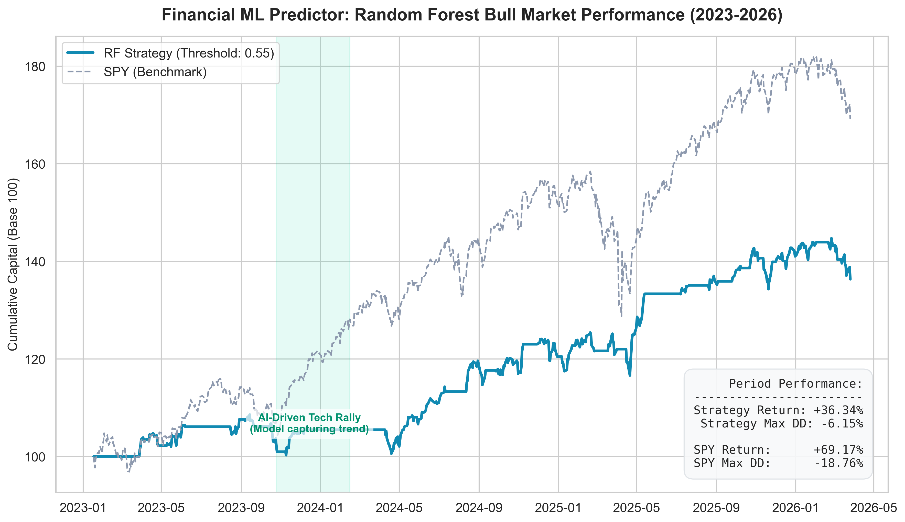
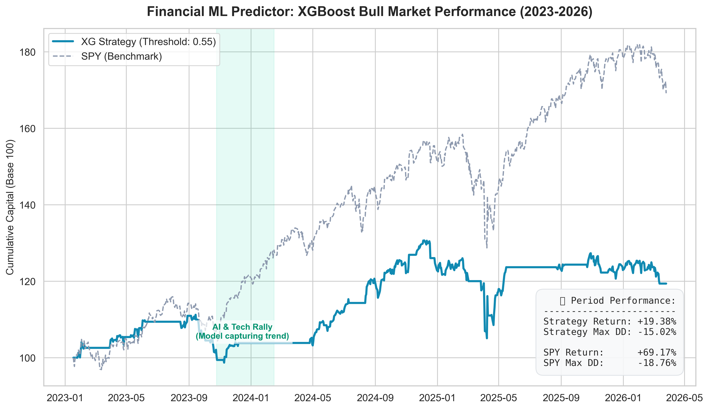
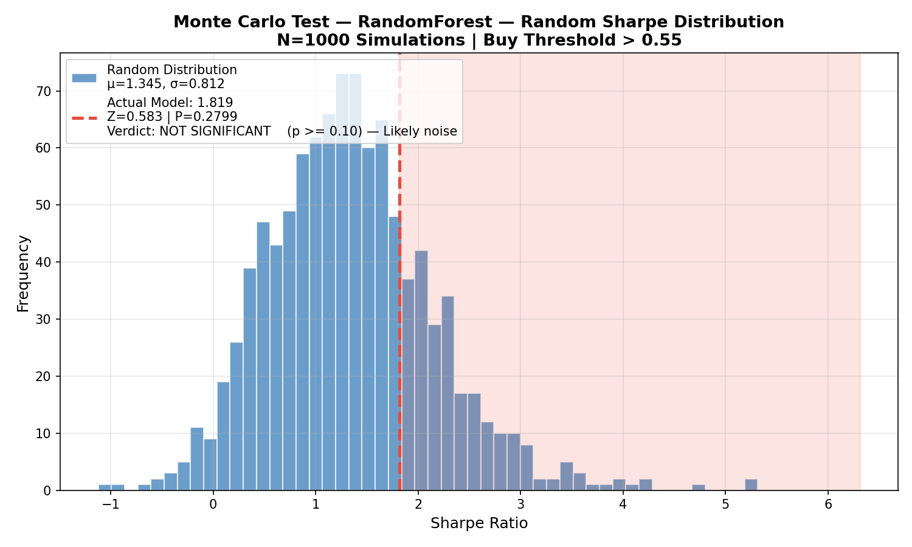

# ML Financial Predictor v3.0
### A Critical Study of Machine Learning in Financial Markets

> 📝 [Read the full technical write-up on Medium](https://medium.com/@jose.pablo.garcia.meza/i-built-an-ml-trading-system-that-learned-to-detect-its-own-lies-1c4772593da2)


This project implements a complete Machine Learning pipeline designed to predict the direction of the **SPY (S&P 500)** ETF over a 10-day horizon, utilizing **Panel Data (AAPL, MSFT, GOOGL, JPM, SPY)**.
> **Target Definition ($y_t$):**
> The problem is framed as a binary classification task. The target variable evaluates whether the closing price ($P$) will be higher in 10 business days relative to the current day ($t$):
>
> $$y_t = \begin{cases} 1 & \text{if } P_{t+10} > P_t \text{ (Buy Signal)} \\ 
0 & \text{if } P_{t+10} \le P_t \text{ (Wait/Sell Signal)} \end{cases}$$

Unlike previous versions, this repository does not showcase a "winning" strategy. Instead, it offers an **honest and reproducible analysis of why seemingly promising models fail to generate real statistical edge**.

---

## ⚠️ Main Finding

> A model with **ROC-AUC ≈ 0.49** can generate attractive equity curves…  
> but it **does not necessarily possess real predictive power**.

---

## 📊 Empirical Evidence

### 📈 Equity Curve — Bull Market (2023–2026)




- Consistent growth  
- Controlled drawdowns  
- Apparent robustness  

---

### 🎲 Monte Carlo — Significance Test



> ❌ **Key Result:** > The model's performance is **not statistically significant** when compared to random strategies.

---

## 📉 The 2022 Bear Market Case: A False Positive
> **Lesson Learned:** How Data Leakage can disguise itself as a "defensive strategy."

Initially, the model showed solid capital protection during 2022. However, after an internal audit, **this result was invalidated**.

<details>
<summary>🔍 View Structural Error Analysis (Click to expand)</summary>

### ❌ The Problem: Regime-Level Data Leakage
Although there was no *lookahead bias* in the features, the validation period included 2022 data that the model had "seen" indirectly, resulting in:
- **Non-Out-of-Sample Evaluation:** Indirect contamination of the test set.
- **Survivorship Bias:** Involuntary adjustment to a previously known market regime.

### Conclusion 
The defensive performance is **NOT valid**. This finding was the catalyst for implementing *Purging + Embargo* and the *Monte Carlo* simulations that now define this version.
</details>

## 📂 Dataset and Data Partitioning

To ensure the integrity of the study, a strict chronological split was used:

* **Training & Validation (In-Sample):** Historical data up to the end of 2022. Includes the "Bear Market" period, which was used for hyperparameter tuning (explaining the bias detected earlier).
* **Test Set (Out-of-Sample):** From **January 2023 to the present (2026)**. 
    * This is data the model **never saw** during training.
    * This period corresponds to the recent **Bull Market**.
    * **Purpose:** To evaluate if the model truly learned predictive patterns or was merely "memorizing" past volatility.

> 💡 **Critical Note:** Although the 2023+ charts show positive returns, the Monte Carlo test proves that these returns are indistinguishable from luck, confirming that the model lacks real *edge* on out-of-sample data.

---

## 🏗️ System Architecture

```text
yfinance (OHLCV)
   └─► Feature Engineering    # 26 Technical Indicators + shift(1)
         └─► Temporal Splitting # Purging + Embargo (10 days)
               └─► Models       # Random Forest + XGBoost
                     └─► Signals # Threshold 0.55 → BUY / HOLD
                           └─► Backtest # Non-overlapping (Fixed Horizon)
                                 └─► Statistical Eval (Monte Carlo)
```
## Key Findings

### 1. The ROC-AUC Paradox
* A low **ROC-AUC** does not automatically imply uselessness, but it cannot be ignored.
* In this case, the model fails to outperform chance, even in the high-probability tail.

### 2. Filtering ≠ Predicting
The model trades infrequently, reduces exposure, and produces attractive metrics, yet:
* **It generates no real predictive signal.**

### 3. Temporal Instability
Example of yearly accuracy:
* **2023:** ~61%
* **2024:** ~81%
* **2025:** ~69%
* **2026:** ~28%
* ⚠️ **High Variance:** The behavior is not robust.

### 4. Structural Overfitting in Financial Series
Techniques from *Advances in Financial Machine Learning* were implemented:
* Aggressive subsampling ($\alpha = 0.1$)
* Leakage control (Purging + Embargo)
* Fixed non-overlapping horizon

**Result:** The model fails to capture a stable signal.

---

## 🔬 Rigorous Validation
* **No lookahead bias:** Use of `shift(1)`.
* **No leakage:** Strict control between splits.
* **Backtest:** No overlapping trades.
* **Baseline:** Evaluation against a random model.
* **Monte Carlo:** 1,000 simulations.

---

## ❗ Conclusion
This project demonstrates that **an attractive equity curve does not imply edge**. In Financial ML, it is extremely easy to:
1. Overestimate results.
2. Misinterpret metrics.
3. Find patterns where none exist.

---

## 🚀 Roadmap
* **Fractional Differentiation:** Achieving stationarity without losing memory.
* **Feature Clustering:** Reducing collinearity.
* **Meta-labeling + Bet Sizing:** Separating direction from size.
* **Regime Detection:** Switching based on VIX or volatility.
* **Advanced Trading Metrics:** Evaluation beyond ROC-AUC.

---

## 📚 References
* **López de Prado, M. (2018).** *Advances in Financial Machine Learning*. Wiley.
* **Davis, J., & Goadrich, M. (2006).** *The Relationship Between Precision-Recall and ROC Curves*.
* **Chan, E. P. (2008).** *Quantitative Trading*.

> **Final Note:** This repository does not aim to prove that ML works in trading, but rather how easy it is to believe it works when it does not.